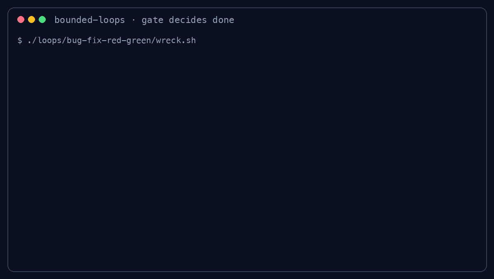

<p align="center">
  
</p>

<h1 align="center">bounded-loops</h1>

<p align="center"><strong>Agent loops that stop when an independent gate passes—not when the agent says it is done.</strong></p>

<p align="center">
  <a href="https://github.com/qualixar/bounded-loops/actions/workflows/ci.yml"></a>
  <a href="https://pypi.org/project/bounded-loops/"></a>
  <a href="https://www.npmjs.com/package/bounded-loops"></a>
  <a href="LICENSE"></a>
</p>



## Quick start

```bash
pip install bounded-loops
git clone https://github.com/qualixar/bounded-loops
cd bounded-loops
bl run loops/bug-fix-red-green --yes
```

No API key is needed. The default cassette proposes the fix; a real pytest gate
checks it. The command ends with a receipt:

```text
✓ [DONE] gate-passed (laps: 1)  ledger: loops/bug-fix-red-green/.ledger.jsonl
Gate verified: the independent acceptance gate passed after 1 lap.
Next: inspect the ledger above; use --keep-workspace when you need to debug the resulting files.
```

Now see why the gate matters:

```bash
./loops/bug-fix-red-green/wreck.sh   # exits 1: the agent claimed GREEN; pytest still fails
bl run loops/convergence-demo --yes  # two failed verdicts, then DONE on lap 3
```

The hero GIF is generated from those real commands. Rebuild it with
`python3 scripts/render_demo_gif.py`; [`assets/demo.tape`](assets/demo.tape) is
the scene specification.

## Use a real agent

The keyless examples make the control flow reproducible. They do not pretend a
cassette is a model. Swap in a credentialed runner when you want the agent to
perform each turn:

```bash
bl run loops/citation-existence-check --runner codex --yes
bl run loops/citation-existence-check --runner claude-code --yes
```

The Codex path uses `codex exec --json` in the engine's isolated scratch
workspace, maps Codex failure events to an auditable `ERROR`, and records live
input/output token usage. See the committed [Codex run receipt](docs/real-run-example/README.md).

## What the engine does

Each loop is a folder containing a task, a broken seed, a runner, an independent
gate, bounds, and optional recorded turns. On every lap:

1. The runner works inside a quarantined scratch copy.
2. The gate evaluates the result independently.
3. The engine records the verdict, token use, timing, and decision.
4. A passing gate yields `DONE`; a bound yields `HALT`; a crash yields `ERROR`.

The agent's `agent_claimed_done` field is evidence only. It never controls
termination.


The domain rules are standard-library-only. Concrete runners, gates, ledgers,
memory, tracing, approval, and kill-switch implementations sit behind ports;
[`bounded_loops/composition.py`](bounded_loops/composition.py) is the composition
root. Read [ARCHITECTURE.md](docs/ARCHITECTURE.md) for the full design.

## Nine enforced bounds and a kill switch

| # | Bound | Enforcement |
|---|---|---|
| 1 | Iteration and stall limits | `max_iterations`, `no_progress_window` |
| 2 | Scratch sandbox | isolated copy; symlinks refused |
| 3 | Input quarantine | secrets and key material excluded by default |
| 4 | Output schema | JSON Schema gate when configured |
| 5 | Tracing | one span per lap, with a no-op fallback |
| 6 | Regression evaluation | the selected independent gate |
| 7 | Token budget | accumulated runner usage |
| 8 | Human approval | explicit or rung-derived approval |
| 9 | Wall-clock limit | inter-lap budget plus subprocess timeouts |

`BOUNDED_LOOPS_KILL` is checked before every lap. Gate commands are tokenized
and run without a shell. Runner environments use an allowlist, and protected
gate/reporter files can be declared with `forbid:`. Details and threat
boundaries are in [NINE-BOUNDS.md](docs/NINE-BOUNDS.md) and [SECURITY.md](SECURITY.md).

## Runners and gates

| Runner | Purpose |
|---|---|
| `stub` | Replays deterministic turns; keyless and offline |
| `shell` | Pipes the prompt to a configured CLI |
| `python_callable` | Runs framework glue in a spawned, scrubbed process |
| `codex` | Runs the logged-in Codex CLI and parses JSONL events and usage |
| `claude-code` | Runs Claude Code and parses its JSON result and usage |
| `antigravity` | Runs `agy` with rung-derived approval policy |
| `docker` / `worktree` | Adds stronger process or repository isolation |

Built-in gates include `command`, `pytest`, `jsonschema`, and `composite`, plus
typed adapters for `osv`, `checkov`, `gitleaks`, `semgrep`, `trivy`,
`promptfoo`, `great_expectations`, and `axe`. Typed gates parse structured
output and fail closed on malformed reports. Run `bl gates` to see local tool
availability.

## 68 runnable loop folders

The source catalog contains 68 loops across software, security, finance, legal,
healthcare, retail, operations, enterprise/ERP, testing, content, research, and
business roles. Sixty-four are keyless; four framework examples require their
framework package (`langgraph`, `crewai`, `agent-framework`, or `google-adk`).
Missing packages now fail with the exact install command.

These examples are deliberately dominated by deterministic acceptance checks:
linters, schemas, tests, reconciliation rules, citation reporters, and security
scanners. That is a strength, not a claim that every domain problem reduces to a
linter. Bounded loops are appropriate when the result has a checkable contract.
When evaluation is subjective, keep a human approval gate.

Start with:

- [`convergence-demo`](loops/convergence-demo/) to watch two gate failures, a
  successful third lap, and a deliberate max-iteration trip.
- [`citation-existence-check`](loops/citation-existence-check/) to see a legal
  citation corrected over two laps while the reporter and checker stay protected.
- [`bug-fix-red-green`](loops/bug-fix-red-green/) for the smallest pytest loop
  and its intentionally ungated counterexample.
- [`catalog/README.md`](catalog/README.md) for the full role and pattern index.

The accessibility example is explicitly a static HTML checker. It does not
claim rendered-DOM coverage; use axe or Lighthouse against a live page for that.

## Create your own loop

```bash
bl new --list
bl new pytest-basic my-loop
bl lint my-loop
bl run my-loop --yes
```

Packaged templates work from a wheel; the full 68-loop catalog lives in this
repository. Follow [WRITING-A-LOOP.md](docs/WRITING-A-LOOP.md) and prove the
unfixed seed fails before proving the fix passes.

## Codex, Claude Code, MCP, and editors

Install the MCP extra, then the native Codex plugin:

```bash
pip install "bounded-loops[mcp]"
codex plugin marketplace add qualixar/bounded-loops
codex plugin add bounded-loops@bounded-loops
```

The Codex package uses `.codex-plugin/plugin.json` and ships the bounded-loops
skill plus `bounded-loops-mcp` wiring. Claude Code and Antigravity packages, the
isolated install test, and local-development commands are documented in
[`plugins/README.md`](plugins/README.md). VS Code/GitHub Copilot MCP files are
also included.

The MCP server exposes run, lint, list, show, gates, audit, and run-history tools
over the same composition root. Confirmation binds the gate, runner, and
iteration cap; a caller cannot preview a safer run and confirm a different one.

## Known limitations

- Framework example glue uses deterministic edits and currently reports
  `changed: true`; production glue should compute a before/after diff so the
  no-progress bound remains meaningful.
- `content-fact-gate` and an OSV scan require network access. Scanner-backed
  gates require their named binary; the quick start itself is offline.
- `python_callable` runs in a deliberately small environment allowlist. Import
  side effects that depend on arbitrary parent variables will not work.
- The npm package is a thin Python launcher, not a second engine. Python 3.11+
  is required.

## Credits

bounded-loops did not invent loop engineering. Addy Osmani named and described
the practice in [Loop Engineering](https://addyosmani.com/blog/loop-engineering/).
The project also builds on Andrej Karpathy's evaluability framing, Boris Cherny's
agent-loop practice, Peter Steinberger's prompting-loop discussion, Matthew
Berman's [Loop Library](https://github.com/Forward-Future/loopy), and runnable
verifier-loop projects such as proof-loop, repo-task-proof-loop, and agentops.
This repository's contribution is the executable harness: enforced bounds,
independent gates, receipts, and a cross-domain source catalog.

## Contributing, citation, and security

See [CONTRIBUTING.md](CONTRIBUTING.md). A contributed loop needs a real failing
seed, a passing fix, a testable done-condition, and `bl lint --contrib` compliance.
Never use “an LLM decides” as the gate.

Research citation metadata is in [CITATION.cff](CITATION.cff). Report gate
bypasses or sandbox escapes privately through [SECURITY.md](SECURITY.md).

[Apache-2.0](LICENSE). Copyright &copy; 2026 Varun Pratap Bhardwaj / Qualixar,
an independent AI Reliability Engineering research initiative.
