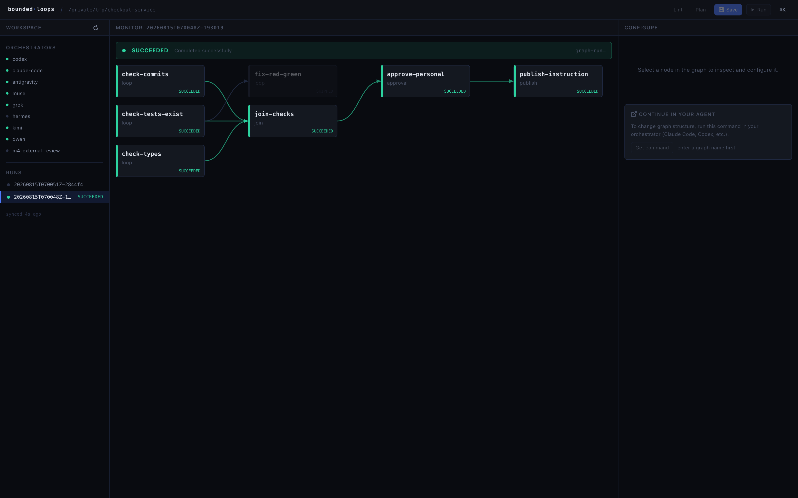
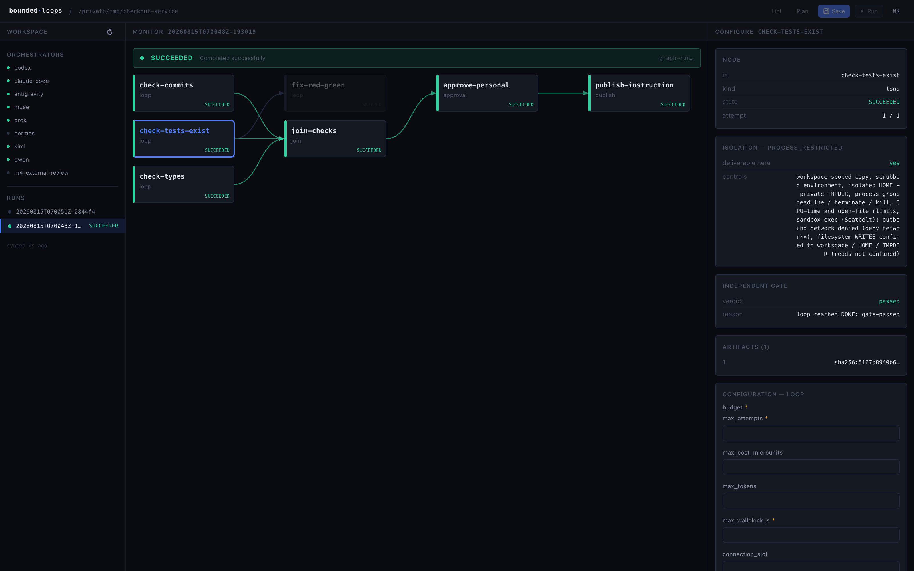
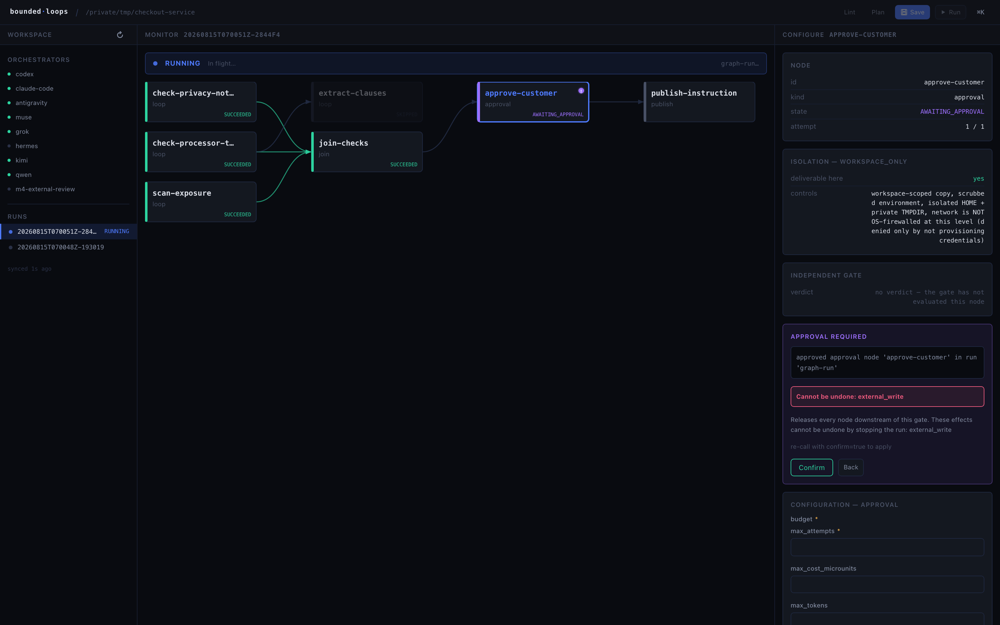
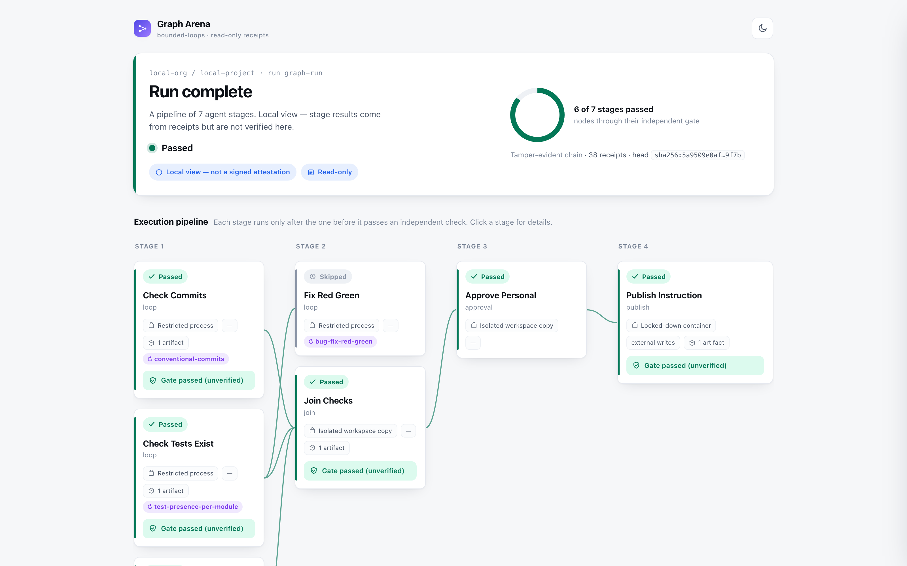
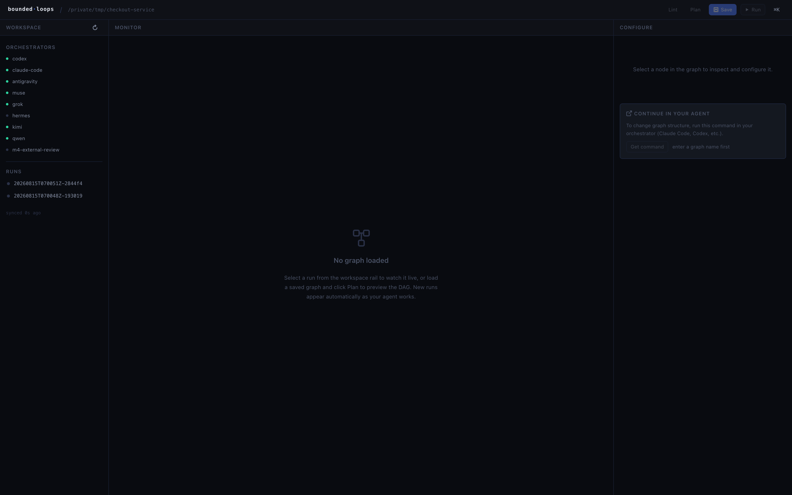
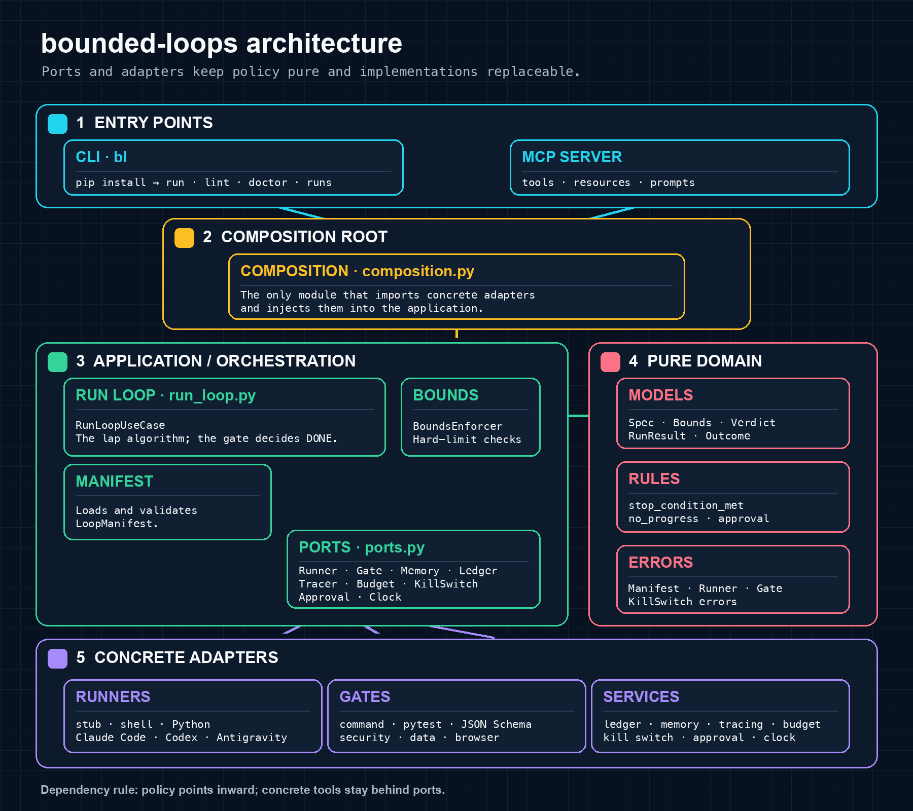

<p align="center">
  
</p>

<h1 align="center">bounded-loops</h1>

<p align="center"><strong>Two things ship in this package: a standalone bounded loop engine and a graph engine that composes loops into DAGs. Each is a complete, independently useful program.</strong></p>

<p align="center">
  <a href="https://github.com/qualixar/bounded-loops/actions/workflows/ci.yml"></a>
  <a href="https://pypi.org/project/bounded-loops/"></a>
  <a href="https://www.npmjs.com/package/bounded-loops"></a>
  <a href="LICENSE"></a>
</p>


```bash
pip install bounded-loops
git clone https://github.com/qualixar/bounded-loops && cd bounded-loops
bl run loops/bug-fix-red-green --yes    # a real planted bug, a real pytest gate, no API key
```

68 loop packages ship in [`loops/`](loops/); 64 need no API key. The catalog is in
the repository, not the wheel — `bl run` takes a path and writes its ledger beside
the loop.

---

## See it working

Every screenshot below is a real run of a shipped reference graph on a laptop, with no
credential and no network. Nothing is mocked or staged.

```bash
bl graph run --execute graphs/solo-builder-ship/graph.yaml
bl monitor                 # opens on 127.0.0.1, loopback only, one-time token
```

### The monitor

`bl monitor` is a local web UI over the same run directory the CLI reads. It holds no state
of its own — close it and nothing is lost, because the receipt log was always the truth.



### What the engine actually recorded

Click a node and you get what the receipts say, not a summary of them: the isolation tier the
OS really enforced, the independent gate's own verdict **and its reason**, and the artifact
digest.



### A human gate, and what saying yes releases

An approval node declares no effects of its own, so "approve this" reads as harmless right up
until the publish it lets through. The confirm panel names the effects downstream of the gate
and flags the ones stopping the run will not take back.

Note the gate line: **"no verdict — the gate has not evaluated this node."** A human hold is
not a gate pass, and the UI says so rather than painting a green check.



### A shareable report

`bl graph arena --run <dir>` writes one self-contained HTML file. No server, no network, no
build step — send it to someone who was not there.



---

## What this is

**A bounded loop** is a single agent task driven to a verified finish. A worker
attempts the task; a separate object — the gate — decides pass or fail; the engine
retries up to a declared bound. The gate is never the worker. The worker's own
claim of "done" is recorded as metadata and ignored by the control path. State is
an append-only hash-chained event log. Run one with `bl run <loop>`.

**A graph** (`bl graph`) is a DAG whose nodes are agent tasks. Use it when you
need fan-out, conditional branching, join, human approval checkpoints, or an
irreversible publish step. Each node has its own gate, and the same invariant
holds whether you run one task or fifty.

**Loops are not only graph substrate.** Someone with one gated task gets full
value from a loop in ten minutes, never touching the graph engine.

**Four surfaces, one truth.** The CLI, the monitor, the MCP server and the Arena report are all
drivers over the same run directory; none holds state the log lacks. Close any of them mid-run
and lose nothing. When two of them disagreed — in 0.6, in five places — that was the bug, and
the log was the arbiter.

---

## Loop or graph?

| You have… | Use |
|---|---|
| One task with a checkable finish condition | `bl run` — a loop |
| A bug fix, a citation check, a schema validation, a lint that must pass | `bl run` — a loop |
| Multiple tasks where step B depends on step A | `bl graph` |
| Fan-out to independent nodes, then a join | `bl graph` |
| A human approval checkpoint before an action | `bl graph` |
| An irreversible publish step that must be gated | `bl graph` |
| Branching: route differently on failure vs success | `bl graph` |

Shipped loops that stand on their own: `bug-fix-red-green`,
`citation-existence-check`, `cors-not-wildcard`, `dependency-pinning`,
`dead-import-clean`, `contract-clause-extraction`. Full index:
[`catalog/README.md`](catalog/README.md).

---

## Quickstart: a loop

No API key. The runner is a stub; the gate is real pytest.

```bash
pip install bounded-loops
git clone https://github.com/qualixar/bounded-loops
cd bounded-loops
bl run loops/bug-fix-red-green --yes
```

Output:

```text
[bounded-loops] About to run loop 'bug-fix-red-green':
  runner : stub
  gate   : pytest -q
✓ [DONE] gate-passed (laps: 1)  ledger: loops/bug-fix-red-green/.ledger.jsonl
Gate verified: the independent acceptance gate passed after 1 lap.
```

Now see a loop that needs multiple laps:

```bash
bl run loops/convergence-demo --yes
```

```text
✓ [DONE] gate-passed (laps: 3)  ledger: loops/convergence-demo/.ledger.jsonl
```

The worker's `agent_claimed_done` field is recorded in the ledger and never
read by the control path. Only the gate decides when the loop exits.

---

## Quickstart: a graph

No agent CLI or credentials needed. Runs **in-process**, no OS sandbox — the banner
says "DEMONSTRATION" and the run directory is marked accordingly.

```bash
bl graph demo --out ./demo-run
bl graph status --run ./demo-run
```

The next one is different: it enforces **real** OS isolation (macOS Seatbelt or Linux
bubblewrap, no Docker), still with no credential.

```bash
bl graph run --execute --out ./sandbox-demo
```

A built-in probe node runs inside the sandbox, attempts a network connection and an
out-of-workspace write, and an independent gate passes only if the OS denied both.

To run a real agent graph (needs your already-logged-in `claude`, `codex`, `grok`,
`muse`, or `agy` CLI):

```bash
bl graph run --execute manifest.yaml \
  --connections connections.json \
  --inputs inputs.json \
  --out ./my-run
```

Full instructions for creating `manifest.yaml`, `connections.json`, and
`inputs.json` are in [docs/graph-quickstart.md](docs/graph-quickstart.md).

---

## Watching a run: `bl monitor`

```bash
bl monitor          # 127.0.0.1 only, ephemeral per-invocation token, opens your browser
```

A local web UI over the run directory — live DAG, per-node evidence, spend, and the approval
controls. It detects which agent CLIs you already have logged in and lists your runs; it never
asks for a credential of its own.



It is a **view**, not a service. Loopback bind, a token per invocation that never touches disk,
and a same-origin requirement on every data route — so a page in another tab cannot drive it
even if it had the token. Kill it mid-run and nothing is lost.

It also declines to over-report. A node the gate never evaluated reads "no verdict" rather than
showing a pass, and approving a gate tells you which downstream effects it releases and which
of those stopping the run will not take back.

Full posture, limits, and how to read the panels: [docs/monitor.md](docs/monitor.md).

---

## Bounded loops in depth

### The engine loop

On every lap:

1. The runner works inside a quarantined scratch copy of `seed/`.
2. The gate evaluates the workspace independently.
3. The engine records the verdict, token use, and timing.
4. A passing gate yields `DONE`; exhausted bounds yield `HALT`; a crash yields `ERROR`.

The gate is a separate object from the runner. The controller checks `worker is gate`
(Python identity) and refuses to run if the check trips. This forbids one object
playing both roles — it does not enforce that the gate's logic is truly independent
of the worker's output. A wrapped worker (`GateWrapper(worker)`) that rubber-stamps
its input passes the identity check. The guarantee: no code path branches on
`agent_claimed_done`; only `verdict.passed` can produce a `DONE` outcome.

### The 68-loop catalog

64 loops are keyless (stub runner + real mechanical gate — offline, deterministic,
no API key). 4 require a framework package (`langgraph`, `crewai`, `agent-framework`,
or `google-adk`). Gate kinds: 44 `command`, 10 `jsonschema`, 9 `pytest`, 3 `composite`,
1 `osv`, 1 `checkov`. No loop uses "an LLM decides" as its gate.

Domains: software, security, finance, legal, healthcare, retail, operations,
enterprise/ERP, testing, content, research, business.

Worth reading first:

- [`bug-fix-red-green`](loops/bug-fix-red-green/) — the smallest pytest loop. Ships
  `wreck.sh`, which runs the same prompt ungated: the agent claims GREEN, pytest fails.
- [`citation-existence-check`](loops/citation-existence-check/) — the checker and
  reporter are in `forbid:`, so the agent cannot edit what the gate reads.
- [`convergence-demo`](loops/convergence-demo/) — two failures, a passing third lap,
  and a deliberate max-iteration trip.

### Create your own loop

```bash
bl new --list                        # show available templates
bl new pytest-basic my-loop          # scaffold from a template
bl lint my-loop                      # validate manifest and bounds
bl run my-loop --yes                 # run it
```

Full how-to with worked examples: [docs/WRITING-A-LOOP.md](docs/WRITING-A-LOOP.md).

### Runners

| Runner | Purpose |
|---|---|
| `stub` | Deterministic replay; keyless and offline |
| `shell` | Pipes the prompt to a configured CLI |
| `python_callable` | Framework glue in a spawned, scrubbed process |
| `codex` | Logged-in Codex CLI; parses JSONL events and usage |
| `claude-code` | Claude Code; parses its JSON result and usage |
| `antigravity` | `agy` with rung-derived approval policy |
| `docker` / `worktree` | Stronger process or repository isolation |

### Built-in gates

`command`, `pytest`, `jsonschema`, `composite`, plus typed adapters for `osv`,
`checkov`, `gitleaks`, `semgrep`, `trivy`, `promptfoo`, `great_expectations`, and
`axe`. Typed gates parse structured output and fail closed on malformed reports.
Run `bl gates` to check local tool availability.

---

## Graph engine in depth

`bl graph` compiles a YAML manifest into an execution plan, validates every
connection binding at compile time, and runs each node inside a native OS sandbox
(macOS Seatbelt or Linux bubblewrap — no Docker). Every run writes an append-only,
hash-chained event log. The read-only Arena renders that log without re-executing
anything.

### Node kinds

`loop`, `tool`, `router`, `join`, `approval`, `audit`, `research_source`,
`research_claim`, `subgraph`, `publish`.

**What `bl graph run --execute` runs today:** nodes with an admitted `local_cli` or `https`
connector binding, plus `kind: loop`, `join`, `approval` and `publish`. Every other kind is still
refused by a fail-closed preflight.

### Graph commands

```bash
bl graph lint manifest.yaml                              # validate the DAG
bl graph plan manifest.yaml --connections connections.json    # compile to plan
bl graph run --execute manifest.yaml \
    --connections connections.json --out ./run           # run; pauses at approval (exit 3)
bl graph approve --run ./run --node <id> \
    --decision approved                                  # record decision, resume
bl graph console --run ./run                             # browser click-to-approve
bl graph arena --run ./run                               # render read-only Arena HTML
bl graph status --run ./run                              # text projection of the event log
bl graph init                                            # configure egress posture
```

### Connector modes

- **Local-CLI** — runs your already-logged-in agent CLI (`claude`, `codex`, `grok`,
  `muse`, `agy`) as a subprocess. The engine never reads, stores, or logs credentials.
- **BYOK / HTTPS** — routes a node to a model API via a no-secret egress broker that
  issues single-use, time-bound leases and denies SSRF and DNS-rebind (private,
  loopback, link-local, CGNAT and reserved ranges).

### What the graph gate does and does not check

`StructuralAcceptanceGate` re-reads the node's promoted artifact from the store,
separately from the worker, and passes if it is non-empty and UTF-8-decodable.
**That is structural acceptance — a well-formed reply exists. It is not a semantic
review.** The cross-model audit engine (`--audit-plan`) is the overlay for that.

### Honest capability matrix

| Capability | Status |
|---|---|
| Gate-verified DAG (worker ≠ gate, controller-enforced identity check) | Shipped — object-identity check only: one object cannot hold both roles, but gate logic is not proven independent ([detail](#the-engine-loop)) |
| Local-CLI + BYOK/HTTPS connectors via `bl graph run --execute` | Shipped |
| `kind: loop` nodes executable via `bl graph run --execute` | Shipped — digest-pinned package, receipt-verifying gate. `isolation` is per-node and never defaulted; the six reference graphs pin `process_restricted`. `workspace_only` is NOT an OS sandbox |
| No-secret egress broker (single-use leases; SSRF / DNS-rebind denied) | Shipped |
| Hash-chained event log; on resume, full chain re-verified | Shipped — local runs marked `LOCAL/UNVERIFIED` |
| Cross-model audit coverage gate (`--audit-plan` → Arena verdict) | Shipped — read-side; independence is receipt-asserted |
| Durable approvals — `bl graph approve` / `bl graph console` | Shipped — local posture only (no TLS / role auth) |
| ALLOWLIST egress cage for `local_cli` nodes (macOS Seatbelt, opt-in) | Shipped — OPEN is the default; ALLOWLIST is opt-in |
| Hosted receipt verification · tamper-evident approvals · sandboxed arbitrary-tool nodes | Deployment-provided seams / roadmap |

Full detail: [docs/graph-capabilities.md](docs/graph-capabilities.md).
Runnable walkthrough: [docs/graph-quickstart.md](docs/graph-quickstart.md).

---

## Nine enforced bounds and a kill switch

| # | Bound | Enforcement |
|---|---|---|
| 1 | Iteration and stall limits | `max_iterations`, `no_progress_window` |
| 2 | Scratch sandbox | isolated copy; symlinks refused |
| 3 | Input quarantine | secrets and key material excluded by default |
| 4 | Output schema | JSON Schema gate when configured |
| 5 | Tracing | one span per lap, with a no-op fallback |
| 6 | Regression evaluation | the selected independent gate |
| 7 | Token budget | accumulated runner usage |
| 8 | Human approval | explicit or rung-derived approval |
| 9 | Wall-clock limit | inter-lap budget plus subprocess timeouts |

`BOUNDED_LOOPS_KILL` is checked before every lap. Gate commands are tokenized and
run without a shell. Runner environments use an environment-variable allowlist.
Details and threat boundaries: [docs/NINE-BOUNDS.md](docs/NINE-BOUNDS.md) and
[SECURITY.md](SECURITY.md).

---

## Architecture

Hexagonal (ports-and-adapters). The domain rule — the gate decides, not the agent —
lives in one file (`bounded_loops/application/run_loop.py`) and holds regardless
of which runner, gate, or storage backend a loop uses. The graph engine reuses the
same ports per node. [`bounded_loops/composition.py`](bounded_loops/composition.py)
is the composition root.



Full design: [docs/ARCHITECTURE.md](docs/ARCHITECTURE.md).

---

## Codex, Claude Code, MCP, and editors

```bash
pip install "bounded-loops[mcp]"
git clone https://github.com/qualixar/bounded-loops
cd bounded-loops
codex plugin marketplace add .
codex plugin add bounded-loops@bounded-loops
```

The `bounded-loops-mcp` server exposes loop tools — run, lint, list, show, gates,
audit, run-history — over the composition root. The graph MCP shim
(`graph_status` / `graph_resume` / `graph_approve`) mounts onto a deployment's own
server via a runtime facade; subject identity binds to the MCP session, never an LLM
tool argument.

**MCP 2.0** (SDK `2.0.0`, protocol revision `2026-07-28`). Clients on the 2025-era handshake
are still served from the same process, and a test asserts both eras see the same tools with
the same schemas — a capability that exists on one revision and not the other is a capability
nobody can rely on.

**Running a loop takes two calls, and the second needs a token from the first.**

```
bl_run(loop_dir=…, confirm=false)                    → {preview: {...}, confirm_token: "…"}
bl_run(loop_dir=…, confirm=true, confirm_token=…)    → runs
```

The token is an HMAC over the run's full executable identity — gate command, runner,
`agent_cmd`, cassette, iteration cap, and a content hash of the loop's files — signed with a
secret generated at server start and valid for 15 minutes. Edit `loop.yaml` between the two
calls and it stops verifying, which is the point: the thing you approved is the thing that
runs. What it proves is narrower than it looks, and worth stating plainly — the caller was
shown this exact preview by this server, recently. It does not prove a human read it. The
human gate is the rung refusal, which turns down L2/L3 loops outright.

**Provider plugins are a boundary, not a sandbox.** A plugin is arbitrary code in this
process and can monkey-patch the worker. The narrower guarantee worth stating exactly:
the engine's own resolution path will not hand a plugin's values to a subprocess, and
its checks cannot be defeated by mutating something they read.

Claude Code and Antigravity packages, the isolated install test, and
local-development commands: [`plugins/README.md`](plugins/README.md).

---

## Known limitations

- A `kind: loop` node whose `loop_package` digest resolves on this host runs; one that
  does not is refused at preflight.
- `bl graph run --execute` pauses at `approval` nodes (exit code 3, `AWAITING_APPROVAL`)
  and resumes via `bl graph approve`. Sandboxed arbitrary-tool nodes are a later phase.
- The `ALLOWLIST` egress cage is a network-only restriction on macOS Seatbelt. A
  caged subprocess still has full filesystem access.
- The Arena's `LOCAL/UNVERIFIED` notice is accurate: local runs are not verified
  against a hosted receipt server.
- `content-fact-gate` and OSV scans require network access; the quickstart is offline.
- Framework example glue uses deterministic edits and reports `changed: true`; production
  glue should compute a before/after diff.
- Python 3.11+ required. The npm package is a thin Python launcher, not a second engine.

---

## Credits

bounded-loops did not invent loop engineering. Addy Osmani named and described
the practice in [Loop Engineering](https://addyosmani.com/blog/loop-engineering/).
The project also builds on Andrej Karpathy's evaluability framing, Boris Cherny's
agent-loop practice, Peter Steinberger's prompting-loop discussion, Matthew
Berman's [Loop Library](https://github.com/Forward-Future/loopy), and runnable
verifier-loop projects such as proof-loop, repo-task-proof-loop, and agentops.
This repository's contribution is the executable harness: enforced bounds,
independent gates, receipts, a graph engine, and a cross-domain source catalog.

---

## Contributing, citation, and security

See [CONTRIBUTING.md](CONTRIBUTING.md). A contributed loop needs a real failing
seed, a passing fix, a testable done-condition, and `bl lint --contrib` compliance.
Never use "an LLM decides" as the gate.

Research citation metadata is in [CITATION.cff](CITATION.cff). Report gate
bypasses or sandbox escapes privately through [SECURITY.md](SECURITY.md).

[Apache-2.0](LICENSE). Copyright &copy; 2026 Varun Pratap Bhardwaj / Qualixar,
an independent AI Reliability Engineering research initiative.
