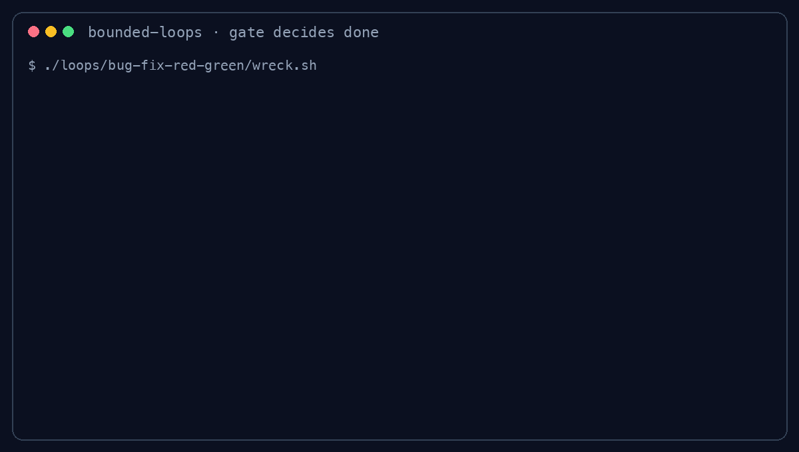

<p align="center">
  
</p>

<h1 align="center">bounded-loops</h1>

<p align="center"><strong>A graph engine for reliable AI agents: a DAG of independently-gated bounded loops where a producer never grades its own work, and every run is a replayable, receipt-backed record.</strong></p>

<p align="center">
  <a href="https://github.com/qualixar/bounded-loops/actions/workflows/ci.yml"></a>
  <a href="https://pypi.org/project/bounded-loops/"></a>
  <a href="https://www.npmjs.com/package/bounded-loops"></a>
  <a href="LICENSE"></a>
</p>



The flagship is **`bl graph`**: compose bounded loops into a DAG where an independent gate — never the producer — decides each node, connectors run on your own CLI subscription or a no-secret BYOK key, and every run is a hash-chained, content-addressed record you can replay. It is built on a keyless loop engine you can try in ten seconds.

## Quick start

```bash
pip install bounded-loops
git clone https://github.com/qualixar/bounded-loops
cd bounded-loops
bl run loops/bug-fix-red-green --yes
```

No API key is needed. The default cassette proposes the fix; a real pytest gate
checks it. The command ends with a receipt:

```text
✓ [DONE] gate-passed (laps: 1)  ledger: loops/bug-fix-red-green/.ledger.jsonl
Gate verified: the independent acceptance gate passed after 1 lap.
```

Now see why the gate matters:

```bash
./loops/bug-fix-red-green/wreck.sh   # exits 1: the agent claimed GREEN; pytest still fails
bl run loops/convergence-demo --yes  # two failed verdicts, then DONE on lap 3
```

The `agent_claimed_done` field is evidence only. It never controls termination —
in a single loop or across a graph.

## The graph engine

`bl graph` runs a directed acyclic graph of nodes. Each node is a bounded loop
with its own worker and its own **independent** acceptance gate; the controller
enforces that the worker never grades its own node. A run writes an append-only,
hash-chained event log plus content-addressed artifacts, and the read-only Arena
renders that record without executing anything.

```bash
bl graph init                                         # configure egress posture (optional)
bl graph lint graph.yaml                              # validate the DAG offline
bl graph run graph.yaml --execute \
    --connections connections.json --out ./run        # run — pauses at approval nodes (exit 3)
bl graph approve --run ./run --node <id> \
    --decision approved                               # record a decision and resume
bl graph console --run ./run                          # click-to-approve in a browser
bl graph arena --run ./run --out arena.html           # receipt-derived, read-only view
```

Two connector modes ship today, both credential-safe:

- **Local-CLI** — run your already-logged-in agent CLI (`claude`, `codex`,
  `grok`, `muse`, `agy`) as the node worker. The engine never reads, stores, or
  logs your credentials; authentication stays out-of-band.
- **BYOK / HTTPS** — route a node to a frontier-model API. Pass an
  admitted-connection record (`--admitted admitted.json`); the request goes
  through a **no-secret egress broker** that issues single-use, time-bound leases
  and denies SSRF and DNS-rebind (private, loopback, link-local, CGNAT, and
  reserved ranges). A node with no matching admitted record fails closed.

Add cross-model audit coverage with `--audit-plan audit.json`: independent
auditor nodes grade mandatory coverage cells, and the Arena shows a release
verdict that blocks on any producer-only cell or unresolved high-severity finding.

### Honest capability matrix

`bl graph` is a beta. This is exactly what is enforced today, and where the line
is — no capability is claimed beyond what the shipped code does.

| Capability | Status |
|---|---|
| Gate-verified bounded-loop DAG (worker ≠ gate, controller-enforced) | Shipped |
| Local-CLI + BYOK/HTTPS connectors via `bl graph run --execute` | Shipped |
| No-secret egress broker (single-use leases; SSRF / DNS-rebind denied) | Shipped |
| Receipt-derived, non-executing Arena (hash-chained log, content-addressed artifacts) | Shipped — local runs are marked `LOCAL/UNVERIFIED` |
| Cross-model audit-coverage gate (`--audit-plan` → Arena verdict) | Shipped — read-side; independence is receipt-asserted |
| Durable approvals — `bl graph run` pauses at approval nodes (exit 3); `bl graph approve --run --node --decision` records the decision and resumes; facade / MCP path unchanged | Shipped |
| Click-to-approve console — `bl graph console --run <dir>` serves a loopback-only, token-gated HTML page; same durable machinery as `bl graph approve` | Shipped — local posture only (no TLS / role auth; a hosted deployment must supply those) |
| Egress posture for `local_cli` nodes — `bl graph init` writes `~/.bounded-loops/egress.json`; OPEN is the default (subscription CLI unchanged); ALLOWLIST is opt-in: real macOS Seatbelt cage + loopback proxy, fail-closed without the cage | Shipped — OPEN default; ALLOWLIST selectable; not yet the default tier |
| Hosted receipt verification · tamper-evident approvals ledger · sandboxed arbitrary-tool nodes | Deployment-provided seams / roadmap |

Full detail, run-directory layout, and the deploying-engineer checklist live in
[docs/graph-capabilities.md](docs/graph-capabilities.md),
[docs/graph-quickstart.md](docs/graph-quickstart.md), and
[docs/RELEASE-READINESS.md](docs/RELEASE-READINESS.md).

## What the engine does

Whether a node in a graph or a standalone loop, the unit is the same: a folder
with a task, a broken seed, a runner, an independent gate, bounds, and optional
recorded turns. On every lap:

1. The runner works inside a quarantined scratch copy.
2. The gate evaluates the result independently.
3. The engine records the verdict, token use, timing, and decision.
4. A passing gate yields `DONE`; a bound yields `HALT`; a crash yields `ERROR`.


The domain rules are standard-library-only. Concrete runners, gates, ledgers,
memory, tracing, approval, and kill-switch implementations sit behind ports;
[`bounded_loops/composition.py`](bounded_loops/composition.py) is the composition
root. The graph engine reuses the same ports per node. Read
[ARCHITECTURE.md](docs/ARCHITECTURE.md) for the full design.

## Nine enforced bounds and a kill switch

| # | Bound | Enforcement |
|---|---|---|
| 1 | Iteration and stall limits | `max_iterations`, `no_progress_window` |
| 2 | Scratch sandbox | isolated copy; symlinks refused |
| 3 | Input quarantine | secrets and key material excluded by default |
| 4 | Output schema | JSON Schema gate when configured |
| 5 | Tracing | one span per lap, with a no-op fallback |
| 6 | Regression evaluation | the selected independent gate |
| 7 | Token budget | accumulated runner usage |
| 8 | Human approval | explicit or rung-derived approval |
| 9 | Wall-clock limit | inter-lap budget plus subprocess timeouts |

`BOUNDED_LOOPS_KILL` is checked before every lap. Gate commands are tokenized
and run without a shell. Runner environments use an environment-variable
allowlist, and protected gate/reporter files can be declared with `forbid:`.
Details and threat boundaries are in [NINE-BOUNDS.md](docs/NINE-BOUNDS.md) and
[SECURITY.md](SECURITY.md).

## Runners and gates

| Runner | Purpose |
|---|---|
| `stub` | Replays deterministic turns; keyless and offline |
| `shell` | Pipes the prompt to a configured CLI |
| `python_callable` | Runs framework glue in a spawned, scrubbed process |
| `codex` | Runs the logged-in Codex CLI and parses JSONL events and usage |
| `claude-code` | Runs Claude Code and parses its JSON result and usage |
| `antigravity` | Runs `agy` with rung-derived approval policy |
| `docker` / `worktree` | Adds stronger process or repository isolation |

```bash
bl run loops/citation-existence-check --runner codex --yes
bl run loops/citation-existence-check --runner claude-code --yes
```

Built-in gates include `command`, `pytest`, `jsonschema`, and `composite`, plus
typed adapters for `osv`, `checkov`, `gitleaks`, `semgrep`, `trivy`,
`promptfoo`, `great_expectations`, and `axe`. Typed gates parse structured
output and fail closed on malformed reports. Run `bl gates` to see local tool
availability. See the committed [Codex run receipt](docs/real-run-example/README.md).

## The loop catalog

The source catalog contains 68 loops across software, security, finance, legal,
healthcare, retail, operations, enterprise/ERP, testing, content, research, and
business roles. Sixty-four are keyless; four framework examples require their
framework package (`langgraph`, `crewai`, `agent-framework`, or `google-adk`).

These examples are deliberately dominated by deterministic acceptance checks:
linters, schemas, tests, reconciliation rules, citation reporters, and security
scanners. Bounded loops are appropriate when the result has a checkable
contract. When evaluation is subjective, keep a human approval gate. Start with:

- [`convergence-demo`](loops/convergence-demo/) — two gate failures, a successful
  third lap, and a deliberate max-iteration trip.
- [`citation-existence-check`](loops/citation-existence-check/) — a legal citation
  corrected over two laps while the reporter and checker stay protected.
- [`bug-fix-red-green`](loops/bug-fix-red-green/) — the smallest pytest loop and
  its intentionally ungated counterexample.
- [`catalog/README.md`](catalog/README.md) — the full role and pattern index.

## Create your own loop

```bash
bl new --list
bl new pytest-basic my-loop
bl doctor
bl lint my-loop
bl run my-loop --yes
```

Packaged templates work from a wheel; the full 68-loop catalog lives in this
repository. Follow [WRITING-A-LOOP.md](docs/WRITING-A-LOOP.md) and prove the
unfixed seed fails before proving the fix passes.

## Codex, Claude Code, MCP, and editors

```bash
pip install "bounded-loops[mcp]"
git clone https://github.com/qualixar/bounded-loops
cd bounded-loops
codex plugin marketplace add .
codex plugin add bounded-loops@bounded-loops
```

The Codex package uses `.codex-plugin/plugin.json` and ships the bounded-loops
skill plus `bounded-loops-mcp` wiring. Claude Code and Antigravity packages, the
isolated install test, and local-development commands are documented in
[`plugins/README.md`](plugins/README.md). VS Code / GitHub Copilot MCP files are
also included.

The `bounded-loops-mcp` server exposes the loop tools — run, lint, list, show,
gates, audit, and run-history — over the composition root. Confirmation binds the
gate, runner, and iteration cap, so a caller cannot preview a safer run and
confirm a different one. The graph engine ships an MCP shim
(`graph_status`/`graph_resume`/`graph_approve`) that a deployment wires onto its
own server with a runtime facade; subject identity is always bound to the MCP
session, never an LLM tool argument.

## Known limitations

- `bl graph run --execute` pauses at approval nodes (exit code 3 AWAITING_APPROVAL) and
  resumes via `bl graph approve`; sandboxed arbitrary-tool nodes are a later phase.
- The `ALLOWLIST` egress cage is wired for `local_cli` nodes on macOS Seatbelt
  (opt-in via `bl graph init` or `BOUNDED_LOOPS_EGRESS_POSTURE`; fail-closed without the
  cage); it is not yet the default tier — `open` remains the default.
- Framework example glue uses deterministic edits and currently reports
  `changed: true`; production glue should compute a before/after diff.
- `content-fact-gate` and OSV scans require network access; the quick start
  itself is offline. The npm package is a thin Python launcher, not a second
  engine. Python 3.11+ is required.

## Credits

bounded-loops did not invent loop engineering. Addy Osmani named and described
the practice in [Loop Engineering](https://addyosmani.com/blog/loop-engineering/).
The project also builds on Andrej Karpathy's evaluability framing, Boris Cherny's
agent-loop practice, Peter Steinberger's prompting-loop discussion, Matthew
Berman's [Loop Library](https://github.com/Forward-Future/loopy), and runnable
verifier-loop projects such as proof-loop, repo-task-proof-loop, and agentops.
This repository's contribution is the executable harness: enforced bounds,
independent gates, receipts, a graph engine, and a cross-domain source catalog.

## Contributing, citation, and security

See [CONTRIBUTING.md](CONTRIBUTING.md). A contributed loop needs a real failing
seed, a passing fix, a testable done-condition, and `bl lint --contrib` compliance.
Never use "an LLM decides" as the gate.

Research citation metadata is in [CITATION.cff](CITATION.cff). Report gate
bypasses or sandbox escapes privately through [SECURITY.md](SECURITY.md).

[Apache-2.0](LICENSE). Copyright &copy; 2026 Varun Pratap Bhardwaj / Qualixar,
an independent AI Reliability Engineering research initiative.
