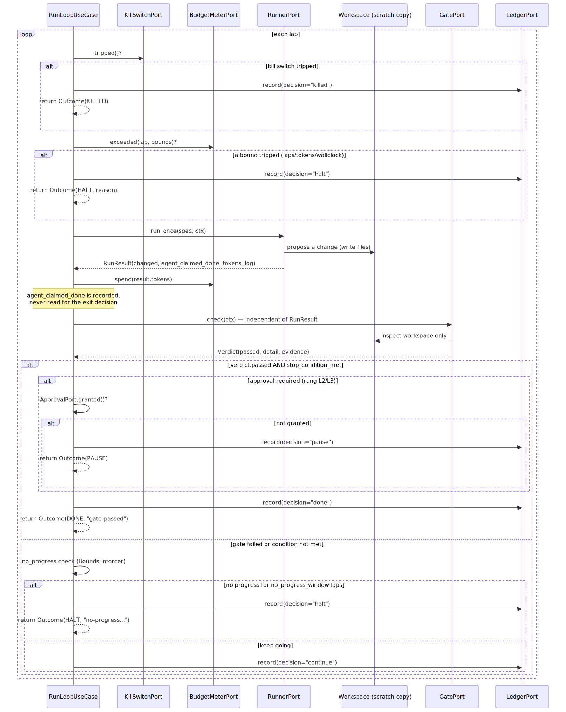

# Architecture

bounded-loops is built as a hexagonal (ports-and-adapters) system. The
motivation is not academic: the one invariant the whole project exists to
guarantee — *the engine never trusts the agent's own claim of "done"* — has
to be true no matter which agent, which gate, or which storage backend a
given loop uses. Hexagonal architecture is what makes that provable instead
of merely documented: the rule lives in exactly one file
(`bounded_loops/application/run_loop.py`), every adapter is swappable behind
a `Protocol`, and there is exactly one place in the codebase allowed to wire
a concrete adapter in.

## The three layers

**Domain** (`bounded_loops/domain/`) is pure data and pure functions: no I/O,
no framework, stdlib imports only. `models.py` defines the frozen
dataclasses that flow through the whole system — `Spec`, `Bounds`,
`Verdict`, `RunResult`, `LoopContext`, `LedgerEntry`, `Outcome` — plus the
`Rung` (L1/L2/L3) and `Status` (DONE/HALT/PAUSE/KILLED) enums. `rules.py`
holds the three pure predicates the engine calls: `stop_condition_met`,
`no_progress`, `rung_requires_approval`. `errors.py` defines the exception
taxonomy (`ManifestError`, `RunnerError`, `GateError`,
`KillSwitchTripped`) — notably, **a gate that runs and reports failure is
not an error**; `Verdict(passed=False, ...)` is the normal shape of "the
agent hasn't fixed it yet." `GateError` is reserved for the gate itself
being unable to execute (binary missing, timeout, crash).

**Application** (`bounded_loops/application/`) is the orchestration layer.
`ports.py` is the seam: nine `@runtime_checkable` Protocols
(`RunnerPort`, `GatePort`, `MemoryPort`, `LedgerPort`, `TracerPort`,
`BudgetMeterPort`, `KillSwitchPort`, `ApprovalPort`, `ClockPort`) that any
adapter must satisfy structurally — no inheritance required. `run_loop.py`
implements `RunLoopUseCase`, the single lap loop described below.
`bounds.py`'s `BoundsEnforcer` owns the no-progress history (the sliding
window of "did the workspace change this lap"), delegating the actual
predicate to `domain.rules.no_progress`. `manifest.py` loads and validates
`loop.yaml` + `bounds.yaml` into one frozen `LoopManifest` — the single
shape `composition.py` consumes. Application code imports domain and ports
only; it never imports a concrete adapter class.

**Adapters** (`bounded_loops/adapters/`) are the concrete implementations:
`adapters/runners/` (stub, shell, python_callable, claude-code, codex,
antigravity, plus the `AnchorGuardRunner` decorator), `adapters/gates/`
(command, pytest, jsonschema, osv, checkov), and `adapters/io/` (file-based
ledger and memory, OTel/no-op tracer, the token/wallclock budget meter, the
env-var kill switch, CLI/auto approval, the UTC clock). Every adapter
implements exactly one port and imports nothing from `application/` beyond
the port protocols and domain models it needs.

## The composition root

`bounded_loops/composition.py` is the only module in the codebase permitted
to import concrete adapter classes — its own docstring states the rule:
"THIS FILE imports everything (that's its job)... No other file may import
from adapters/runners/\* or adapters/gates/\* directly." Its public function,
`wire(manifest, ...)`, takes a validated `LoopManifest` and returns a fully
assembled `RunLoopUseCase` ready to call `.run()`. Concretely, `wire()`:
resolves the runner (from `RUNNER_REGISTRY`, or a CLI `--runner` override),
resolves the gate (from `GATE_REGISTRY`, or a CLI `--gate-override` that
wraps any shell command as a `CommandGate`), applies a `--max-iterations`
override by constructing a new frozen `Bounds` (never mutating the existing
one), builds an isolated scratch workspace by copying the loop's `seed/`
into a fresh `tempfile.mkdtemp()` directory, wraps whichever runner was
chosen in `AnchorGuardRunner` (workspace-integrity enforcement for every
runner, not just the stub), and finally constructs the I/O adapters
(ledger, memory, tracer, budget meter, kill switch, approval, clock) before
assembling the `RunLoopUseCase`.

Two things about this wiring are deliberate, not incidental. First, ledger
and memory files live at the loop-dir level, *outside* the scratch
workspace the agent can write to — an adversarial or buggy agent cannot
rewrite its own audit trail, because the audit trail isn't in its sandbox.
Second, the runner is instantiated by bare global class name inside
`_instantiate_runner`, not via a dict lookup on `RUNNER_REGISTRY` — a dict
literal captures the class object once at import time, which
`unittest.mock.patch` on the module attribute can't retroactively rebind;
referencing the bare name resolves from the module's live globals at call
time, which is exactly what `mock.patch` needs to work.

## The frozen invariant: the gate decides, not the agent

`RunResult` (what a runner reports after one turn) carries an
`agent_claimed_done: bool` field. It is recorded — every `RunResult` is
consumed by `BoundsEnforcer.record_lap()` for no-progress tracking, and its
`log`/`tokens` fields feed the ledger and budget meter — but it is never
read when deciding whether the loop exits. Read `run_loop.py` step by step:
after `d.runner.run_once(...)` returns a `RunResult`, the very next
consequential line is `verdict = d.gate.check(ctx)` — the `GatePort` is
called independently, against the workspace, with no visibility into what
the runner said about itself. `GatePort.check()`'s own docstring is
explicit: "NEVER call the agent; NEVER see RunResult." Only
`verdict.passed and stop_condition_met(spec, verdict)` can produce a DONE
or PAUSE outcome. `agent_claimed_done` is stored in the ledger as
metadata (via the cassette/log path) purely for audit — a human or a
future gate can see "the agent said it was done on lap 2" next to "the
gate did not agree until lap 4" — but it is structurally incapable of
short-circuiting the loop, because no code path branches on it.

## Ports-and-adapters diagram

> Editable source: [`diagrams/ports-and-adapters.mmd`](diagrams/ports-and-adapters.mmd) · regenerate with `mmdc -i diagrams/ports-and-adapters.mmd -o diagrams/ports-and-adapters.svg`

## Loop-flow sequence diagram

One call to `RunLoopUseCase.run()` executes an unbounded number of laps
until a terminal `Outcome` is reached. Every lap starts with the
kill-switch poll — the highest-priority stop, checked before anything else,
including the budget check.

> Editable source: [`diagrams/loop-flow-sequence.mmd`](diagrams/loop-flow-sequence.mmd) · regenerate with `mmdc -i diagrams/loop-flow-sequence.mmd -o diagrams/loop-flow-sequence.svg`

## State diagram of a lap's outcomes

> Editable source: [`diagrams/lap-outcomes-state.mmd`](diagrams/lap-outcomes-state.mmd) · regenerate with `mmdc -i diagrams/lap-outcomes-state.mmd -o diagrams/lap-outcomes-state.svg`

## See also

- [NINE-BOUNDS.md](./NINE-BOUNDS.md) — each bound, its `bounds.yaml` field,
  and the exact component that enforces it.
- [WRITING-A-LOOP.md](./WRITING-A-LOOP.md) — the concrete scaffold and
  verify protocol for authoring a new loop.
