# The nine bounds (+ kill switch)

Every loop's `bounds.yaml` maps onto nine enforced bounds. They are not nine
flat booleans living in one adapter — they are enforced across the engine's
layers, which is the point: no single misconfigured or malicious adapter can
quietly disable one. This document expands the mapping table from the
top-level README with the exact `bounds.yaml` field, the exact component
that enforces it, and why each bound exists.

## 1. Iteration control — hard lap cap + no-progress stall detection

**Field:** `bounds.max_iterations` (required, hard ceiling of 1000 enforced
in `manifest.py`, non-overridable in v1) and `bounds.no_progress_window`
(default 3). **Enforced by:** `RunLoopUseCase.run()` in `run_loop.py`, which
calls `BudgetMeterPort.exceeded(lap, bounds)` at the top of every lap for
the hard cap, and `BoundsEnforcer.check_no_progress(bounds)` (delegating to
the pure `domain.rules.no_progress`) after each failed gate check for the
stall case.

Why it matters: an ungated agent loop's most common failure mode isn't a
crash, it's an agent that keeps "trying" forever — burning tokens and wall
time while never converging. A hard lap cap turns "runs forever" into "fails
loudly at lap N," and the no-progress window catches the subtler case where
the agent is still running but has stopped actually changing anything
(`RunResult.changed == False` for `window` consecutive laps) — a spin, not
a stop.

## 2. Sandboxing — isolated scratch copy, symlinks refused

**Field:** `bounds.sandbox` (default `true`). **Enforced by:**
`composition._make_scratch_workspace()`, called from `wire()` before any
runner is invoked.

Why it matters: the loop's `seed/` is the source of truth checked into the
repo. If the agent operated on it directly, every run would mutate the
loop's own fixture — the next `bl run` would start from wherever the last
run left off, and a community-contributed loop's `seed/` could never be
trusted to reproduce. The engine instead copies `seed/` into a fresh
`tempfile.mkdtemp()` directory per run. The function also refuses to run if
`seed/` itself, or anything inside it, is a symlink — a malicious loop
could otherwise ship `seed -> ~/.ssh` and have `copytree` follow it,
defeating the sandbox before the copy even happens.

## 3. Input quarantine — the "governed workspace" guarantee

**Field:** `bounds.quarantine_inputs` (default `true`). **Enforced by:** the
`ignore=_quarantine_ignore` callback passed to `shutil.copytree` inside
`_make_scratch_workspace()`.

Why it matters: bounded-loops explicitly invites community loop PRs, which
means a loop's `seed/` is not fully trusted. Without this bound, a
malicious loop could plant a reader for `.env`/`.ssh`/`.aws`/`id_rsa`-style
files, or a careless one could ship a real credential that then reaches an
agent running inside the sandbox. Quarantine excludes secret-bearing paths
by name (`.git`, `.env*`, `.ssh`, `.aws`, `.gnupg`, `.netrc`, `credentials`,
`id_rsa`/`id_dsa`/`id_ecdsa`/`id_ed25519`) and by suffix (`.pem`, `.key`,
`.p12`, `.pfx`) at every directory level of the copy, case-insensitively.
Set `false` only for a loop that legitimately needs such a file present
(e.g. a secret-scanning demo with a deliberately fake key).

## 4. Output schema validation

**Field:** `bounds.schema` (a path string, or `null`). **Enforced by:**
`JsonSchemaGate`, which a loop opts into via `gate.kind: jsonschema` in
`loop.yaml`; `composition._instantiate_gate()` wires the schema path from
`manifest.bounds.schema`.

Why it matters: for loops whose "done" condition is producing correctly
shaped structured output (not passing a test suite), a JSON Schema is a
mechanical, dependency-light way to prove shape and type correctness
without writing a bespoke checker. `JsonSchemaGate` treats a missing or
non-conforming `output.json` as a normal `Verdict(passed=False)`, never an
exception — only a missing/malformed *schema file itself* raises
`GateError` at construction time.

## 5. Tracing — one OTel span per lap

**Field:** `bounds.trace` (default `true`). **Enforced by:** the
`TracerPort` — `OtelTracer` when both `bounds.trace` is true and OTel is
requested via the `BOUNDED_LOOPS_OTEL` env var (checked in
`composition._otel_requested()`), otherwise `NoopTracer` by default, which
keeps the repo dependency-free and keyless out of the box.

Why it matters: loop engineering that can't be observed can't be debugged
or trusted in production — a span per lap is the minimum telemetry needed
to answer "how many laps did this take, and where did the time go" without
grepping a ledger file by hand. Defaulting to a no-op tracer means this
bound costs nothing for the keyless quick-start.

## 6. Regression evaluation — satisfied by the gate choice, not a `Bounds` field

**Field:** none — this bound has no `bounds.yaml` key. **Enforced by:**
whichever `GatePort` adapter the loop selects via `gate.kind` in
`loop.yaml` (`command`, `pytest`, `jsonschema`, `osv`, `checkov`).

Why it matters: "did this change actually fix the thing, without breaking
something else" is inherently gate-specific — a legal-citation checker and
a vulnerability scanner have nothing in common mechanically. Rather than
force a generic regression-eval boolean that would mean nothing across
domains, the project makes the gate itself the unit of "is this a real,
independent regression check" — every shipped gate is a real tool
(pytest, a JSON Schema, an OSV/Checkov scan, or any exit-code-checked
command), never "an LLM decides."

## 7. Token budget

**Field:** `bounds.max_tokens` (an int, or `null` for no cap). **Enforced
by:** `BudgetMeterPort.exceeded()` (concretely `BudgetMeter` in
`adapters/io/budget.py`), checked at the top of every lap, fed by
`BudgetMeter.spend(result.tokens)` called immediately after each runner
turn.

Why it matters: an agent that never stops but also never crashes is a
billing incident waiting to happen. Token accounting is only as honest as
its source, though: `claude-code` parses real `total_cost_usd`/`usage`
tokens from the CLI's own JSON output; `shell`/`codex`/`antigravity`
report `0` tokens today — the README calls this an honest tool limitation,
not a silently-swallowed gap — while `stub`/`python_callable` supply
whatever count the cassette or glue code provides.

## 8. Human approval gating

**Field:** `bounds.require_approval` (default `null`, meaning "derive from
rung"). **Enforced by:** `domain.rules.rung_requires_approval()` (pure
predicate), invoked in `run_loop.py` right after a gate passes, gating
whether `ApprovalPort.granted()` must return `True` before a DONE outcome
is returned. Composition wires `CliApproval` (prompts stdout/stdin) when
approval is required, `AutoApproval` (always returns `True`) otherwise.

Why it matters: passing the gate is necessary but should not always be
sufficient to let an agent's work ship unattended. The rung ladder gives a
sane default — L1 (report) never needs approval because a human is reading
every verdict anyway; L2 (assisted) and L3 (unattended) require it by
default, because "the mechanical gate agreed" and "a human is comfortable
merging this" are different bars. `bounds.require_approval` can override
the rung-derived default explicitly in either direction.

## 9. Wall-clock timeout — inter-lap ceiling, not "unbounded" on null

**Field:** `bounds.max_wallclock_s` (an int, or `null`). **Enforced by:**
`BudgetMeterPort.exceeded()` for the *inter-lap* ceiling (checked before
each lap begins, via `time.monotonic()` since the meter was constructed);
the runner's and gate's own subprocess `timeout_s` for the *in-lap* guard
against a single long turn.

Why it matters: `manifest.py`'s `_load_bounds()` is explicit that
`max_wallclock_s: null` in `bounds.yaml` does **not** mean "run forever" —
it is normalized to a conservative 3600-second (1-hour) default at
manifest-load time. This is a deliberate security fix: an unbounded
`max_iterations` (already capped at 1000) combined with a truly unbounded
wallclock and token budget would still describe an effectively-unlimited-
cost loop. A loop that genuinely needs longer than an hour must say so
explicitly, not get it by omission.

## The kill switch — highest priority, polled first

**Env var:** `BOUNDED_LOOPS_KILL` (any non-empty value trips it).
**Enforced by:** `EnvKillSwitch.tripped()`, polled by `RunLoopUseCase.run()`
at the very top of every lap — before the budget check, before the runner
is ever invoked.

Why it matters: every other bound is evaluated by engine logic reasoning
about the loop's own state (laps, tokens, wallclock, progress). The kill
switch is the one bound designed for a human or supervisor process to pull
externally, on demand, for any reason at all — and it's deliberately an
environment variable rather than a workspace-local file, because a file
inside the scratch workspace sits in the same trust boundary as
agent-writable content; an untrusted agent could touch or delete a `.kill`
sentinel it can see, but it cannot reach into its own supervisor's
environment.

## Where each bound sits across the layers

> Editable source: [`diagrams/bounds-across-layers.mmd`](diagrams/bounds-across-layers.mmd) · regenerate with `mmdc -i diagrams/bounds-across-layers.mmd -o diagrams/bounds-across-layers.svg`

## See also

- [ARCHITECTURE.md](./ARCHITECTURE.md) — the hexagonal design these bounds
  are wired into.
- [WRITING-A-LOOP.md](./WRITING-A-LOOP.md) — how a new loop configures these
  fields in practice.
